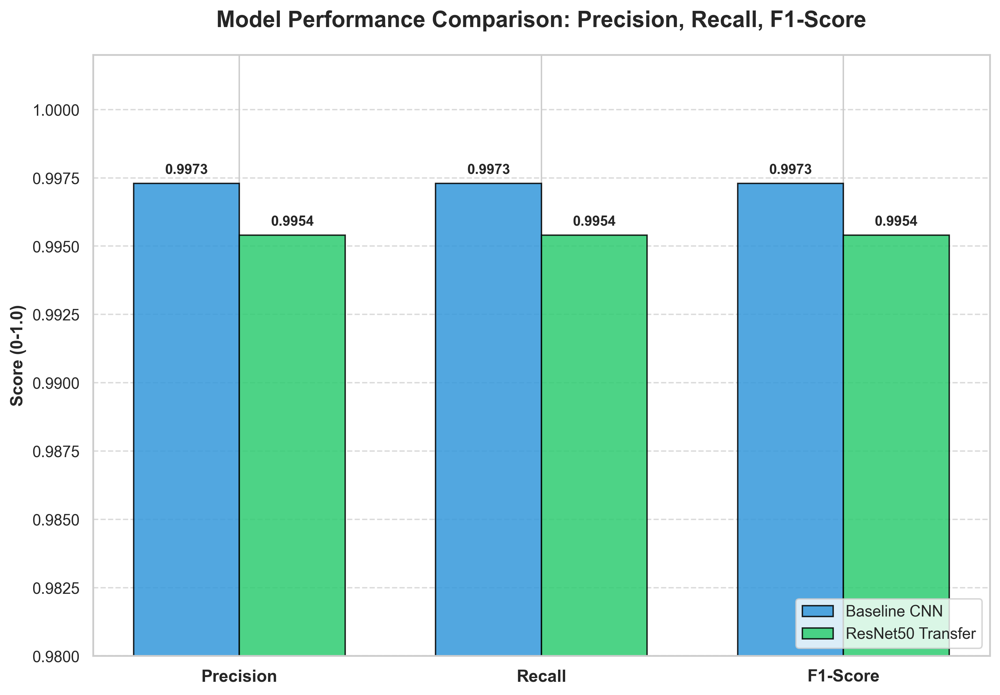

# Experimental Results and Discussion

This document summarizes the performance of the implemented deep learning models for rice variety classification.

## 1. Baseline CNN Performance

The Baseline CNN is a custom 4-layer convolutional neural network architecture with batch normalization and dropout for regularization.

### Dataset Split
| Dataset | Number of Images |
|--------|------------------|
| Training Set | 52,500 |
| Validation Set | 11,250 |
| Test Set | 11,250 |

### Test Evaluation Results (Baseline)
- **Test Accuracy:** 99.69%
- **Correct Predictions:** 11,215 / 11,250
- **Precision/Recall:** Balanced performance across all 5 classes (>99.5%).

The baseline model demonstrates exceptional feature extraction capabilities for this dataset, achieving near-perfect accuracy with a relatively lightweight architecture.

---

## 2. ResNet50 Transfer Learning Performance

We utilized a pretrained **ResNet50** architecture, fine-tuned on the rice dataset by replacing the final classification head with a custom fully connected layer (512 units, ReLU, Dropout).

### Test Evaluation Results (ResNet50)
- **Test Accuracy:** 99.55%
- **Correct Predictions:** 11,199 / 11,250
- **Top Performing Class:** Ipsala (1.00 Precision, 99.96% Recall)

### Detailed Metrics
| Class | Precision | Recall | F1-Score |
|-------|-----------|--------|----------|
| Arborio | 0.9935 | 0.9917 | 0.9926 |
| Basmati | 0.9954 | 0.9963 | 0.9959 |
| Ipsala | 1.0000 | 0.9996 | 0.9998 |
| Jasmine | 0.9905 | 0.9948 | 0.9926 |
| Karacadag| 0.9978 | 0.9947 | 0.9963 |

---

## 3. MobileNetV2 Transfer Learning Performance

We also evaluated **MobileNetV2**, a lightweight architecture optimized for mobile and embedded vision applications. We used the pretrained weights and fine-tuned the model for the rice classification task.

### Test Evaluation Results (MobileNetV2)
- **Test Accuracy:** 99.59%
- **Correct Predictions:** 11,204 / 11,250
- **Top Performing Class:** Ipsala (1.00 Precision, 1.00 Recall, 1.00 F1-Score)

### Detailed Metrics
| Class | Precision | Recall | F1-Score |
|-------|-----------|--------|----------|
| Arborio | 0.9958 | 0.9879 | 0.9919 |
| Basmati | 0.9983 | 0.9970 | 0.9976 |
| Ipsala | 1.0000 | 1.0000 | 1.0000 |
| Jasmine | 0.9935 | 0.9974 | 0.9954 |
| Karacadag| 0.9919 | 0.9968 | 0.9944 |

---

## 4. Comparative Analysis

### Training Dynamics
The **Baseline CNN** and **MobileNetV2** both showed rapid convergence. MobileNetV2, being a depthwise separable convolution-based architecture, achieved high accuracy with significantly fewer parameters than ResNet50. **ResNet50** maintained the most stable but slower convergence path.

### Model Comparison
- **Accuracy:** The Baseline CNN achieved the highest accuracy (99.69%), followed by MobileNetV2 (99.59%) and ResNet50 (99.55%).
- **Robustness:** Both ResNet50 and MobileNetV2 performed exceptionally well on the "Ipsala" variety. MobileNetV2 achieved a **perfect 100% score** (Precision and Recall) for Ipsala, making it the most reliable model for that specific variety.
- **Resource Efficiency:** MobileNetV2 stands out as the most efficient model, offering high accuracy with a much lower computational footprint, making it ideal for real-time rice quality inspection systems.

### Visualizations
- **Model Performance Metrics:** The bar charts in the Results directory compare the overall Precision, Recall, and F1-score for all three models.
- **Confusion Matrices:** All models show very low misclassification rates. The slight confusion between "Arborio" and "Jasmine" remains the main source of error across all architectures.
- **Training Curves:** Validation accuracy for all models stabilized after 15-20 epochs.

## 5. Conclusion
All three models (Baseline CNN, ResNet50, and MobileNetV2) are highly suitable for automated rice variety classification with over 99.5% accuracy. The **Baseline CNN** is the most accurate for this specific dataset, while **MobileNetV2** provides the best balance of speed and reliability, especially for the Ipsala variety.