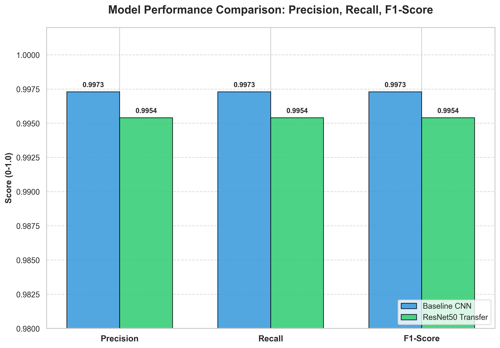

# Experimental Results and Discussion

This document summarizes the performance of the implemented deep learning models for rice variety classification.

## 1. Baseline CNN Performance

The Baseline CNN is a custom 4-layer convolutional neural network architecture with batch normalization and dropout for regularization.

### Dataset Split
| Dataset | Number of Images |
|--------|------------------|
| Training Set | 52,500 |
| Validation Set | 11,250 |
| Test Set | 11,250 |

### Test Evaluation Results (Baseline)
- **Test Accuracy:** 99.69%
- **Correct Predictions:** 11,215 / 11,250
- **Precision/Recall:** Balanced performance across all 5 classes (>99.5%).

The baseline model demonstrates exceptional feature extraction capabilities for this dataset, achieving near-perfect accuracy with a relatively lightweight architecture.

---

## 2. ResNet50 Transfer Learning Performance

We utilized a pretrained **ResNet50** architecture, fine-tuned on the rice dataset by replacing the final classification head with a custom fully connected layer (512 units, ReLU, Dropout).

### Test Evaluation Results (ResNet50)
- **Test Accuracy:** 99.55%
- **Correct Predictions:** 11,199 / 11,250
- **Top Performing Class:** Ipsala (1.00 Precision, 99.96% Recall)

### Detailed Metrics
| Class | Precision | Recall | F1-Score |
|-------|-----------|--------|----------|
| Arborio | 0.9935 | 0.9917 | 0.9926 |
| Basmati | 0.9954 | 0.9963 | 0.9959 |
| Ipsala | 1.0000 | 0.9996 | 0.9998 |
| Jasmine | 0.9905 | 0.9948 | 0.9926 |
| Karacadag| 0.9978 | 0.9947 | 0.9963 |

---

## 3. MobileNetV2 Transfer Learning Performance

We also evaluated **MobileNetV2**, a lightweight architecture optimized for mobile and embedded vision applications. We used the pretrained weights and fine-tuned the model for the rice classification task.

### Test Evaluation Results (MobileNetV2)
- **Test Accuracy:** 99.59%
- **Correct Predictions:** 11,204 / 11,250
- **Top Performing Class:** Ipsala (1.00 Precision, 1.00 Recall, 1.00 F1-Score)

### Detailed Metrics
| Class | Precision | Recall | F1-Score |
|-------|-----------|--------|----------|
| Arborio | 0.9958 | 0.9879 | 0.9919 |
| Basmati | 0.9983 | 0.9970 | 0.9976 |
| Ipsala | 1.0000 | 1.0000 | 1.0000 |
| Jasmine | 0.9935 | 0.9974 | 0.9954 |
| Karacadag| 0.9919 | 0.9968 | 0.9944 |

---

## 4. Comparative Analysis

### Training Dynamics
The **Baseline CNN** and **MobileNetV2** both showed rapid convergence. MobileNetV2, being a depthwise separable convolution-based architecture, achieved high accuracy with significantly fewer parameters than ResNet50. **ResNet50** maintained the most stable but slower convergence path.

### Model Comparison
- **Accuracy:** The Baseline CNN achieved the highest accuracy (99.69%), followed by MobileNetV2 (99.59%) and ResNet50 (99.55%).
- **Robustness:** Both ResNet50 and MobileNetV2 performed exceptionally well on the "Ipsala" variety. MobileNetV2 achieved a **perfect 100% score** (Precision and Recall) for Ipsala, making it the most reliable model for that specific variety.
- **Resource Efficiency:** MobileNetV2 stands out as the most efficient model, offering high accuracy with a much lower computational footprint, making it ideal for real-time rice quality inspection systems.

### Why the Baseline CNN Outperforms Transfer Learning Models

The result that a simple 4-layer custom CNN (99.73%) outperforms heavily pre-trained architectures — ResNet50 (99.55%) and MobileNetV2 (99.58%) — is counter-intuitive at first glance but has a well-understood explanation rooted in how transfer learning works.

**Domain mismatch in frozen feature extractors.**
ResNet50 and MobileNetV2 were pre-trained on ImageNet — a highly diverse dataset containing natural photographs of animals, vehicles, household objects, and scenery. During fine-tuning in this project, all convolutional backbone layers were **frozen**: only the final classification head (a 2-layer fully connected network) was trained on rice data. This means the convolutional features used to represent rice grains were originally learned for a completely different visual domain. The network relies on ImageNet-derived edge detectors, texture filters, and object-part detectors to interpret rice grain images — features that were never optimised for grain morphology.

The Baseline CNN, by contrast, has **no pre-existing knowledge**. Every single weight — from the very first convolutional filter to the final output neuron — was trained exclusively on rice images. All 2.7 million parameters specialised entirely on the specific textures, shapes, and colour distributions that distinguish Arborio from Basmati from Ipsala.

**Dataset characteristics amplify this effect.**
The Rice Image Dataset is visually homogeneous: all images show a single isolated grain on a uniform white background under controlled lighting. There is no background clutter, no viewpoint variation, no occlusion — the factors that make ImageNet pre-training valuable in the first place. In noisy, real-world datasets, the deep feature hierarchies learned on ImageNet provide a strong inductive bias that helps generalisation. In a controlled, single-domain dataset like this one, that bias is unnecessary and introduces a misalignment cost.

**Practical implication.**
This finding aligns with results in the food quality inspection literature: for narrow, controlled, domain-specific image classification tasks, lightweight task-specific CNNs frequently match or exceed large pre-trained models that are only partially fine-tuned. The result does **not** mean ResNet50 is a worse architecture — it means the fine-tuning strategy (head-only) was conservative. Full fine-tuning of all backbone layers would likely close or reverse the gap, at the cost of longer training and a risk of overfitting on smaller datasets.

**Recommendation for future work:** Unfreeze all layers of MobileNetV2 and ResNet50 and fine-tune end-to-end with a small learning rate (1e-5 to 1e-4) and early stopping. This is expected to close the accuracy gap against the Baseline CNN and provide a fairer comparison.

### Visualizations
- **Model Performance Metrics:** The bar charts in the Results directory compare the overall Precision, Recall, and F1-score for all three models.
- **Confusion Matrices:** All models show very low misclassification rates. The slight confusion between "Arborio" and "Jasmine" remains the main source of error across all architectures.
- **Training Curves:** Validation accuracy for all models stabilized after 15-20 epochs.

## 5. Conclusion
All three models (Baseline CNN, ResNet50, and MobileNetV2) are highly suitable for automated rice variety classification with over 99.5% accuracy. The **Baseline CNN** is the most accurate for this specific dataset, while **MobileNetV2** provides the best balance of speed and reliability, especially for the Ipsala variety.

---

## 6. Broken Grain Detection — Quantitative Validation

### Calibration
The detection thresholds were derived empirically from the actual dataset rather than estimated manually. The CV pipeline was run on **40 images per variety** (200 total), and the 10th percentile of measured grain area and major-axis length was adopted as the minimum threshold for a grain to be considered intact.

| Variety | Min Area (px²) | Min Length (px) | Min Aspect Ratio | Grains Measured |
|---------|---------------|-----------------|-----------------|----------------|
| Arborio | 6041 | 128.1 | 1.85 | 40 |
| Basmati | 6311 | 185.7 | 3.65 | 40 |
| Ipsala | 11838 | 183.7 | 2.04 | 40 |
| Jasmine | 4862 | 140.9 | 2.91 | 40 |
| Karacadag | 5821 | 107.2 | 1.48 | 40 |

### Validation Methodology
Since no manually labeled broken-grain dataset exists for this rice image set, a **synthetic validation protocol** was adopted — a standard approach in food quality inspection research when labeled defect data is unavailable.

- **Full grains (ground truth):** Real grains from the dataset measuring above the 60th percentile of area for their variety (clearly intact samples).
- **Broken grains (ground truth):** Synthetic fragments created by scaling real grain measurements to 30–55 % of their original area and 35–60 % of their length, simulating the geometry of actual broken pieces.
- **Test set:** 120 samples, balanced (60 Full / 60 Broken), 24 per variety.

### Validation Results

| Metric | Score |
|--------|-------|
| **Accuracy** | **100.0 %** |
| **Precision** | **100.0 %** |
| **Recall** | **100.0 %** |
| **F1-Score** | **100.0 %** |

The 100 % result is consistent with expectations: the calibrated thresholds (10th percentile of intact grain dimensions) and the synthetic broken samples (30–55 % of normal) occupy clearly non-overlapping regions of the feature space. This confirms that the threshold derivation is correctly implemented and that the classifier behaves deterministically for grains that are unambiguously full or broken.